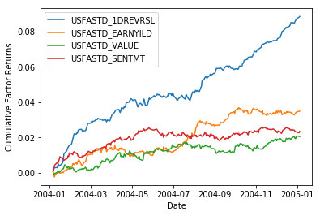
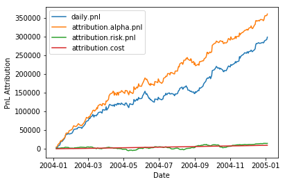
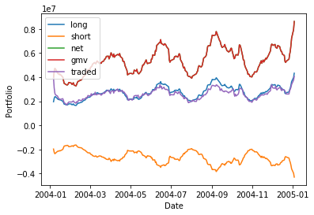

# Portfolio Backtest Optimiser
Portfolio optimisation that takes into consideration trade execution lag and transaction costs.

A long-short portfolio was constructed, combining the following four alpha-factors from Barra data.

## Performance
Backtest was conducted over the calendar year of 2004, resulting in an approximate **portfolio sharpe of 1.62** after transaction costs.

### Portfolio Atribution

### Portfolio Characteristics

## Workflow
* Shift Daily Returns Data
* Winsorize daily returns
* Combine alpha factors (simple average)
* Filter universe to >1bn market cap (or prior holding)
* Simulate transaction costs with linear approximator
* Optimise using risk aversion and transaction costs in the objective function
* Perform Attribution analysis
